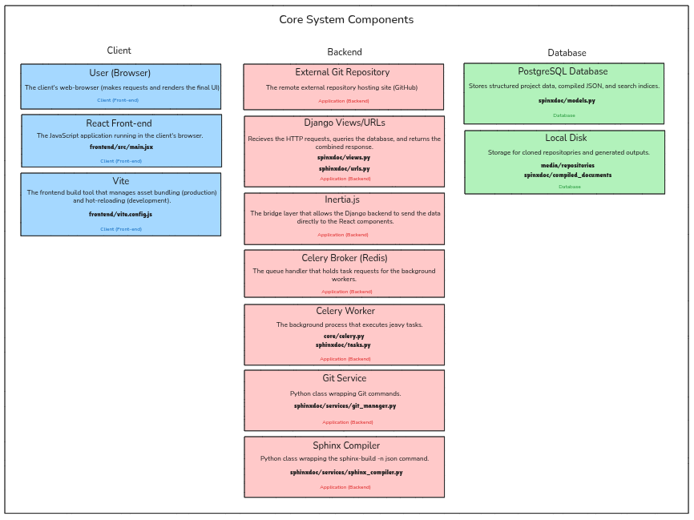
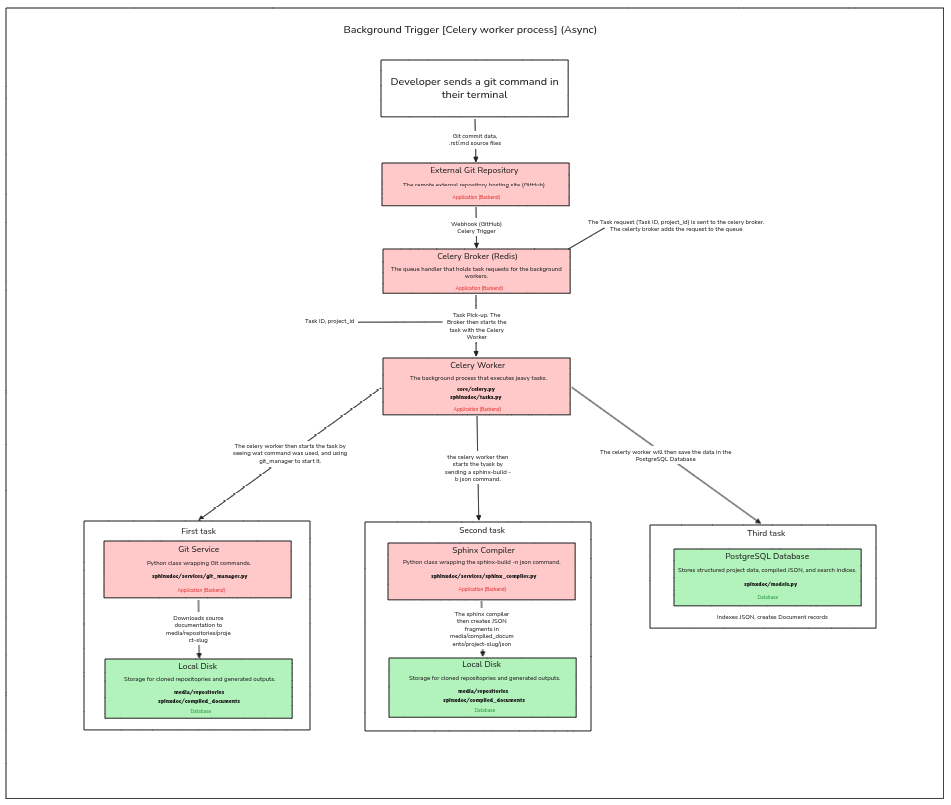
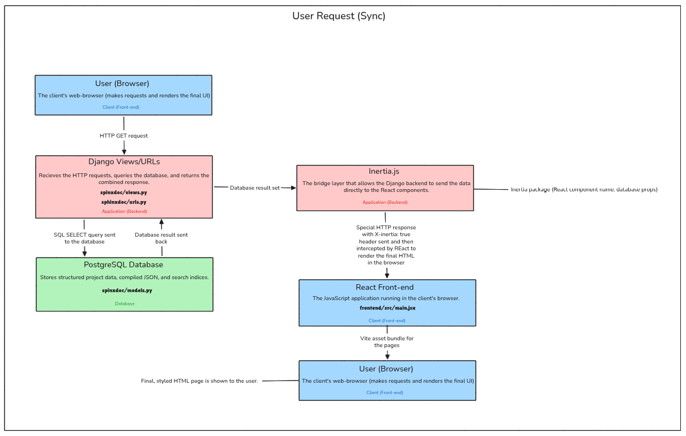

#  Document Management System

## Summary
Maintaining up-to-date, highly reusable softawre documentation is a challenge for engineering teams. Traditional static site genartors (like Sphinx or MkDocs) takes a lot of effort and admin to maintain due to the application feeling disconnected from the main ecosystem. 

This project proposes the ddevelopment of a Monolithic Document Management System. By using an asyncronous dependency (celery) witha Django-to-React bridge (Inertia.js), this system will automatically take in data and seamlessly output documentation without any latency. This minimizes the tedious development and maintance that software developers have to do manually.

## Project Structure:
```text
document-management-system/
├── .venv/
|
├── core/                       
│   ├── __init__.py
│   ├── settings.py
│   ├── urls.py
│   ├── celery.py
|   ├── asgi.py
|   ├── wsgi.py           
│   └── templates/
│       └── app.html  
|
├── media/               
│   ├── repositories/                  
│   └── compiled_documents/          
│       
├── sphinxdoc/                 
│   ├── __init__.py
│   ├── apps.py
|   ├── admin.py
│   ├── models.py
│   ├── views.py
│   ├── urls.py
│   ├── tasks.py
|   ├── tests.py 
|   ├── validators.py            
│   ├── management/
│   │   └── commands/
│   │       └── sync_repos.py   
│   └── services/ 
|       ├── __init__.py             
│       ├── git_manager.py
│       ├── sphinx_compiler.py
│       └── difference_engine.py
│
└── frontend/  
|    ├── node_modules/
|    ├── .gitignore
|    ├── eslint.config.js
|    ├── package-lock.json               
|    ├── package.json
|    ├── vite.config.js
|    └── src/
|        ├── main.jsx
|        ├── app.css
|        ├── Components/         
|        │   ├── SearchBar.jsx
|        │   ├── VersionDropdown.jsx
|        │   ├── ProgressBar.jsx
|        │   └── SidebarNav.jsx
|        │
|        └── Pages/             
|            ├── Management/
|            │   ├── Dashboard.jsx
|            │   ├── AddRepository.jsx
|            │   └── BuildLogs.jsx
|            │
|            ├── Portal/
|            │   ├── DocumentViewer.jsx
|            │   └── SearchResults.jsx
|            │
|            └── Collaboration/
|                ├── InlineEditor.jsx
|                └── VersionCompare.jsx
|
├── .env
├── .gitignore
├── requirements.txt
└── manage.py
```

## Folder Breakdown:

### The Root Directory:
- .env
- .gitignore
- manage.py -> This is the Django command-line utility. This is used run the server.
- project.md
- requirements.txt

### `core/` :
_This is the central part of the Django backend. It holds global configurations that dictate how the server operates._
- `__pycache__/`
- `templates/` -> Holds the global HTML layouts. `app.html` : This is the single HTML file sent to the browser. It loads the copiled Vite assets and serves as the empty container where Inertia mounts the React application.
- `__init__.py`
- asgi.py -> [Asyncronous Server Gateway Interface] Used to deploy the app with async capabilities.
- settings.py -> This is the master configuration file. It connects the database, registers the apps, sets up the Inertia middleware, and configures static file paths.
- urls.py -> The global routing file. It is the file that handles incoming web requests and routes them to the appropriate application.
- wsgi.py -> [Web Server Gateway Interface] Syncronous deployment entry point used by production servers.

### `frontend/` :
_This directory holds the entire client-side application. It is a fully functional Node.js environment nested inside the Django project._
- `node_modules` 
- `public/` -> Static assets
- `src/` -> Core of the react code
    * `Components/` : 
        * ProgressBar.jsx -> Renders a visual loading bar, tracking background celery tasks.
        * SearchBar.jsx -> Input field that queries the PostgreSQL database for document matches.
        * SidebarNav.jsx -> The navigation menu built from the compiled Sphinx table of contents.
        * VersionDropdown.jsx -> A selector that allows users to switch between different Git tags/version of those docs.
    * `Pages/` :
        * `Collaboration/` :
            * InlineEditor.jsx -> A page with a code editor fro modifying Markdown/RST files in the browser.
            * VersionComparison.jsx -> A document displaying the visual differnce between two document versions.
        * `Management/` : 
            * AppRepository.jsx -> A form page for users to submit a new Git repository URL.
            * BuildLogs.jsx -> The main admin overview showing all connected repositories and their status.
            * Dashboard.jsx -> The main admin overview showing all connected repositories and their status.
        * `Portal/` : 
            * DocumentView.jsx -> The main reading interface where the compiled Sphinx HTML is injected and displayed.
            * SearchResult.jsx -> A page displaying the expanded list of matching documents from a search query.
        * app.css -> The global stylesheet.
        * main.jsx -> The frontend entry point. It initializes Inertia and tells it how to map Django responses to the components in the `Page` directory.
    * eslint.config.js
    * package-lock.json
    * vite.config.js -> This is the Vite bundler instructions. It tells Vite how to compile React code and where to put the final files for Django to find.

### `media/` : 
_Acts as the local storage drive for the applications dynamic data._
- `compiled_documents` -> Where the backend tasks will output the final, parsed HTML or JSON fragments generated by Sphinx.
- `repositories` -> Where the raw Git clones of the documentation projects are physically stored after being downloaded.

### `sphinxdoc` : 
_This is a custom Django application that handles all of the backgound logic, database queries and background automization._
- `management/commands` :
    * sync_repos.py -> A script that allows a person to manually trigger repository syncronization from the command line.
- `migrations/` :
    * `__init__.py`
- `services/` :
    * `__init__.py`
    * differnce_engine.py -> Will handle the logic to compare the differences of two projects.
    * git_manager.py -> Contains classes/function that run actual Git commands via the terminal.
    * sphinx_compiler.py -> Contains the logic to execute the `sphinx-build` commands and parse the output.
- `__init__.py`
- admin.py -> Where we will register the database models so they can be viewed/edited in Django's built-in admin panel.
- apps.py -> Configuration file for the `sphinxdoc` application.
- models.py -> Defines the structure of the PostgreSQL database tables.
- tasks.py -> Defines asyncronous Celery jobs.
- tests.py
- urls.py -> The routing area. It maps specific URL's to the appropriate functions in the `views.py` file.
- validators.py -> Contains custopm rules for checking data integrity.
- views.py -> The controllers. These functions recieve web requests from the user, query the databse via `models.py`, and return `render_inertia()` reponses to feed data into the React components.

## System Architecture & Data Flow:
### 1. Core Components:


### 2. Async Flow:


### 3. Sync Flow:



## Project Assets:
### Quick Local Project Navigation:
| Component | Direct Link | Description
| :--- | :--- | :--- |
| **Frontend UI** | [](./frontend/src) | The React components, Tailwind styling, and Inertia entry points. |
| **Core Settings** | [](./core) | Django configuration, database routing, and Celery engine setup. |
| **Background Services** | [](./sphinxdoc/services) | The Python logic for Git cloning and Sphinx JSON compilation. |
| **Database Schema** | [](./sphinxdoc/models.py) | The PostgreSQL blueprints for Projects and Documents. |
| **Task Queue** | [](./sphinxdoc/tasks.py) | The Celery worker instructions that string the services together. | 

### Quick GitHub Project Navigation:
[](https://github.com/JimmyCanJim/document-management-system/tree/main/frontend/src)
[](https://github.com/JimmyCanJim/document-management-system/tree/main/core)
[](https://github.com/JimmyCanJim/document-management-system/tree/main/sphinxdoc/sevices)
[](https://github.com/JimmyCanJim/document-management-system/tree/main/sphinxdoc/models.py)


### Issue board GitHub:
[](https://github.com/users/JimmyCanJim/projects/4)